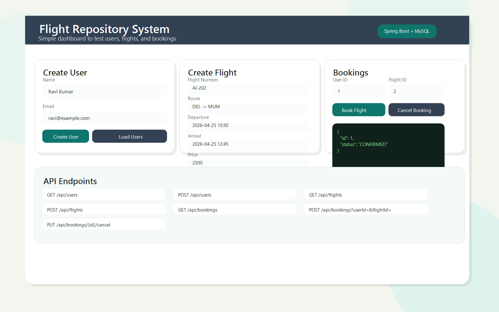

# Flight Repository System

A Spring Boot-based flight booking application that manages users, flights, bookings, wallet balance, cancellation, and refund flow through REST APIs.

## Tech Stack

- Java 21
- Spring Boot
- Spring Web MVC
- Spring Data JPA
- MySQL
- HTML, CSS, JavaScript

## Features

- User management with wallet top-up
- Flight creation, listing, and search by route
- Booking flow with seat validation and wallet deduction
- Booking cancellation with refund and seat restoration
- Global API error handling
- Basic frontend dashboard for API testing

## Run Locally

1. Start MySQL and create the `flightdb` database.
2. Update database credentials in `src/main/resources/application.properties` if needed.
3. Run the application:

```bash
.\mvnw.cmd spring-boot:run
```

4. Open the app in browser:

```text
http://localhost:8080
```

## API Overview

| Module | Method | Endpoint | Description |
|---|---|---|---|
| Users | GET | `/api/users` | Get all users |
| Users | GET | `/api/users/{id}` | Get user by id |
| Users | POST | `/api/users` | Create user |
| Users | PUT | `/api/users/{id}/wallet?amount=500` | Add money to wallet |
| Users | DELETE | `/api/users/{id}` | Delete user |
| Flights | GET | `/api/flights` | Get all flights |
| Flights | GET | `/api/flights/{id}` | Get flight by id |
| Flights | GET | `/api/flights/search?origin=DEL&destination=MUM` | Search flights |
| Flights | POST | `/api/flights` | Create flight |
| Flights | DELETE | `/api/flights/{id}` | Delete flight |
| Bookings | GET | `/api/bookings` | Get all bookings |
| Bookings | GET | `/api/bookings/user/{userId}` | Get bookings by user |
| Bookings | POST | `/api/bookings?userId=1&flightId=2` | Book flight |
| Bookings | PUT | `/api/bookings/{id}/cancel` | Cancel booking |

## Frontend Preview

The project includes a lightweight frontend dashboard for testing APIs.



## Postman Collection

Ready-to-import Postman files are available in the `postman/` folder:

- `postman/flight-repository-system.postman_collection.json`
- `postman/flight-repository-system.local.postman_environment.json`

## Project Structure

- `src/main/java/com/flightapp/Controller` - REST controllers
- `src/main/java/com/flightapp/service` - business logic
- `src/main/java/com/flightapp/repository` - JPA repositories
- `src/main/java/com/flightapp/model` - entity classes
- `src/main/resources/static` - frontend files
